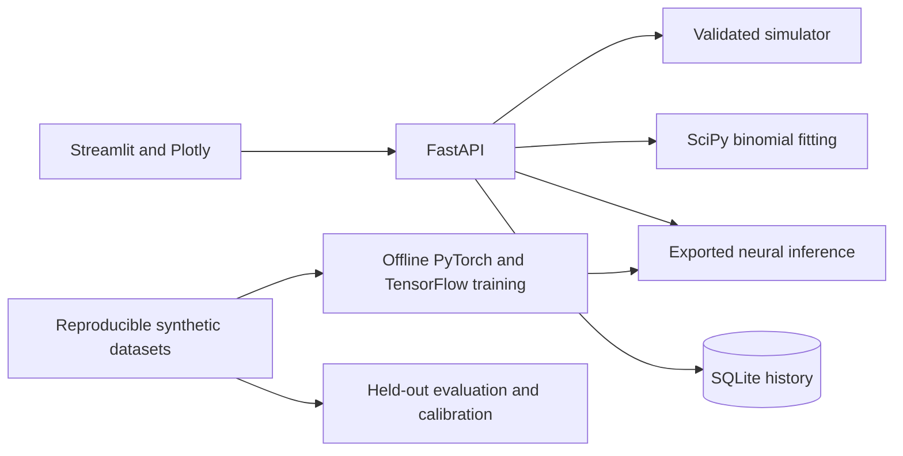

# Quantum Noise Detective

**Live demo:** [quantum.samuelflynn.dev](https://quantum.samuelflynn.dev)

Hosted usage: open the demo, generate an experiment, compare methods, then reveal the simulator truth. Download JSON to keep results. Public history belongs to an anonymous browser session and may become inaccessible after refresh/reconnect. See [hosting and recovery](docs/OPERATIONS.md).

Continuing development in a new chat? Start with [the project handoff](docs/HANDOFF.md)
and the project instructions in [AGENTS.md](AGENTS.md).

A working local lab for diagnosing energy relaxation and pure dephasing in a simulated qubit. Compare conventional statistical fitting with models trained in **PyTorch** and **TensorFlow**, inspect uncertainty, reveal hidden simulator parameters, and reopen saved experiments.

## Run on this machine

Double-click **Start Lab.cmd** in this folder. It starts the lab in the background and opens your browser; no terminal needs to stay open. Repeated launches reuse the running lab.

On Sam's computer, the **Quantum Noise Detective** Windows scheduled task starts the lab at sign-in and checks every minute that the launcher is running. The launcher restarts services that exit, with a short delay between retries. No administrator privileges or stored password are required. The app is unavailable while Windows is asleep, shut down, or signed out; this is still local hosting.

To reinstall automatic startup, run `powershell -ExecutionPolicy Bypass -File scripts\Install-Autostart.ps1` from this folder. To disable automatic startup, run `Disable-ScheduledTask -TaskName 'Quantum Noise Detective'`; signing out then stops the current session's services. Logs are in `%USERPROFILE%\.quantum-noise-detective\logs`. Moving the project or its Python environment requires updating/reinstalling the task.

Open PowerShell in this project folder and run:

```powershell
& "$env:USERPROFILE\.venvs\quantum-noise-detective\Scripts\python.exe" launch.py
```

This starts the API and dashboard, opens the browser, and keeps both services running until Ctrl+C. The dashboard is at [localhost:8501](http://127.0.0.1:8501); interactive API documentation is at [localhost:8765/docs](http://127.0.0.1:8765/docs).

**No API keys, quantum hardware, cloud account, or paid service is required.** Source and configuration live here; generated data, models, and experiment history live in `~/.quantum-noise-detective/`. Set `QND_DATA_DIR` to change that location.

## Explore

- **Experiment lab:** mystery or custom noise, binomial measurement samples, fitting/neural inference, parameter intervals, reveal, JSON export.
- **Model comparison:** 800 frozen test experiments, latency, interval coverage, and distribution-shift stress tests.
- **Experiment history:** persisted measurements, model versions, diagnoses, and reveal status.
- **Field guide:** plain-language physics and an interactive Bloch-sphere trajectory.

Measurements use two preparations: excited-state population decay and X-basis coherence decay. Energy measurements alone cannot identify pure dephasing. All data is synthetic under a specified idealized noise model.

## Recorded benchmark

One local CPU run; 800 test experiments, 256 shots per delay, fixed 64-point grid. Relative errors are medians for the two rates, not prediction accuracy percentages.

| Estimator | Relaxation-rate error | Dephasing-rate error | Median compute |
| --- | ---: | ---: | ---: |
| Conventional binomial fit | 1.07% | 7.20% | 14.88 ms |
| PyTorch-trained MLP | 2.20% | 7.34% | 0.070 ms |
| TensorFlow-trained MLP | 3.31% | 10.38% | 0.070 ms |

Conventional fitting is most accurate; neural inference is faster. **Both neural models use the same lightweight NumPy serving runtime**, numerically checked against the native framework outputs. Latencies exclude loading, HTTP, and UI work and vary by machine. One of 800 conventional fits reported non-convergence; its finite output is included in the error summary.

PyTorch's nominal 90% marginal intervals covered 91.75% of relaxation rates and 88.00% of dephasing rates. TensorFlow's covered 92.375% and 89.25%. These are empirical results, not guaranteed coverage for every regime. See [benchmark report](docs/BENCHMARK.md) and [raw results](docs/BENCHMARK.json).

## Install elsewhere

Use 64-bit Python 3.12. The exact snapshot is for Windows/Python 3.12; other platforms should resolve the direct dependencies in `requirements.txt`.

```powershell
py -3.12 -m venv .venv
.\.venv\Scripts\python.exe -m pip install -r requirements-lock-windows-py312.txt --extra-index-url https://download.pytorch.org/whl/cpu
.\.venv\Scripts\python.exe -m pip install -e . --no-deps
.\.venv\Scripts\python.exe -m qnd.train --framework torch
.\.venv\Scripts\python.exe -m qnd.train --framework tensorflow
.\.venv\Scripts\python.exe -m qnd.evaluate
.\.venv\Scripts\python.exe launch.py
```

Training uses separate processes and compact dense networks. Saved artifacts are generated locally and excluded from Git. The API can run conventional fitting before models exist; restart it after retraining to reload cached exports.

## Development and reproducibility

```powershell
python -m pytest -q
python -m ruff check src tests dashboard scripts launch.py
python scripts/reproduce.py
```

Use the project's Python interpreter. The reproduction script generates a separate dataset, trains, evaluates, and tests in `~/.quantum-noise-detective-reproduction/` unless `QND_DATA_DIR` is set. It does not overwrite live experiments by default. Twenty tests do not require trained models; two integration tests use actual trained artifacts. GitHub Actions is configured to install, train, evaluate, and test on Windows when the repository is published.

## Architecture



Core code is in `src/qnd/`; the dashboard is in `dashboard/app.py`. There is no Qiskit code and no claimed quantum-computational speedup.

- [Project plan](docs/PROJECT_PLAN.md)
- [Setup and environment](docs/SETUP.md)
- [Demo and interview guide](docs/DEMO.md)
- [Build progress](docs/PROGRESS.md)

This release runs locally and on Railway through a pinned Linux Docker image. Hardware validation and baseline uncertainty intervals are not included. See [deployment validation](docs/DEPLOYMENT_VALIDATION.md) for current evidence and hosting limitations.
